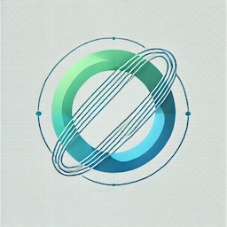

# OPTIC JS
 
**OPTIC JS** is an open-source analytics tracking library designed to empower users and companies by putting control of their data back into their hands. Unlike traditional analytics platforms that rely on third-party data collection, this library allows you to track user interactions and behaviors on your website while maintaining full ownership of your data.

#### OPTIC JS vs OPTIC SIGNALS
Optic JS is the tracker library that powers the Optic Signals platform.

## Features
The following features are planned for OPTIC SIGNALS:

- [ ] Page Visits
- [ ] Time Spent Per Page
- [ ] Real-Time Control Architecture
- [ ] Total Session Length
- [ ] Active Users Tracking (daily, minute, hour, week, month, year)
- [ ] Extract Meta Data from Pages
- [ ] Integration with Google's Web Vitals Library for Performance Tracking
- [ ] Scroll Depth Tracking
- [ ] Copy/Paste Actions Monitoring
- [ ] Form Interactions Tracking
- [ ] File Downloads Tracking
- [ ] Video Engagement Tracking
- [ ] User Actions Tracking
- [ ] Heat Maps Visualization
- [ ] Set Signal Level for Custom Tracking
- [ ] Noise Reduction with Supervisor
- [ ] Signal Integrity Checks
- [ ] Signal Hub for Centralized Management
- [ ] Remote Signal Handling
- [ ] Optic Signals for Live Streaming and Actionable Insights
- [ ] Data Export to Data Warehouses or Data Lakes

## Installation

To install and use the OPTIC SIGNALS library, follow these steps:

1. **Include the Library in Your Project**

   You can include the library directly in your HTML file by adding the following script tag in the `<head>` section:

   ```html
   <script src="https://cdn.yourdomain.com/signals.js" async></script>
   ```

   Alternatively, you can install it via npm: [coming soon!]


2. **Initialize the Library**

   After including the library, you can initialize it in your JavaScript code:

   ```javascript
   const opticSignals = new OpticSignals('your_project_id', {
     trackPageViews: true,
     trackClicks: true, 
   });

   opticSignals.init();
   ```

3. **Configuration Options**

   You can customize the library's behavior by passing configuration options during initialization. Refer to the documentation for a complete list of options [coming soon].

4. **Start Tracking**

   Once initialized, the library will automatically start tracking the specified events based on your configuration.

## Contributing
Coming soon!

## Disclaimer

**OPTIC SIGNALS is currently in the alpha phase of development.** This project is an experiment and is not yet production-ready. Exercise caution while using this library and be aware that features may change as development progresses.

## License

This project is licensed under the MIT License.  

---